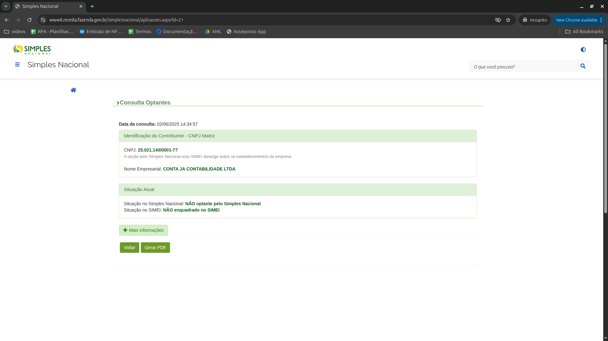
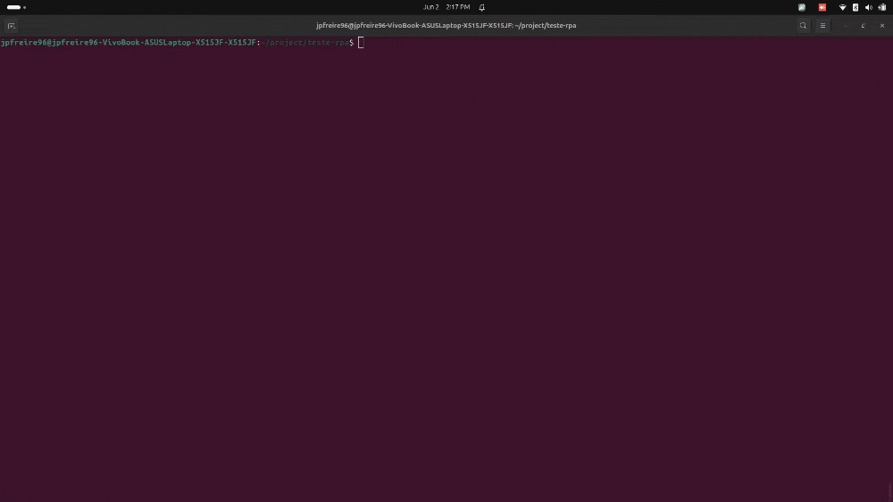

## 🛠️ Modificações Realizadas

Abaixo estão as alterações feitas no código original para que a automação funcionasse corretamente:

- Corrigido o seletor utilizado para capturar o CNPJ, que estava incorreto ou desatualizado em relação à estrutura atual da página.  
- Adição pontual do método `waitForSelector` do Puppeteer para aguardar de forma confiável a presença dos elementos na página.
- Ajustado o seletor do botão de consulta, que estava incorreto ou desatualizado em relação à estrutura atual da página.
- Na função `getData`, foi corrigido o seletor do CNPJ para refletir a estrutura atual da página.  
      Além disso, foram incluídas as raspagens das informações de **Situação no Simples Nacional** e **Situação no SIMEI**, preenchendo corretamente as variáveis `situacaoSN` e `situacaoSimei`.
- Adicionado `puppeteer.executablePath()` na inicialização do Puppeteer para tornar a definição do caminho do Chrome mais flexível
- Adicionado ao código blocos de `try/catch` para capturar e tratar exceções de forma segura.

# 🧪 Teste Técnico – Assistente RPA

Bem-vindo(a)!

Este repositório contém um teste técnico para candidatos à vaga de **Assistente RPA**. Ele consiste em uma automação simples construída com **Node.js** e **Puppeteer**, que acessa um site, raspa informações específicas e exibe os resultados no terminal.

Contudo, a automação **contém falhas propositais**. Seu desafio é identificar e corrigir esses problemas para que o script funcione corretamente.
<br>
<br>


## 🎯 Objetivo
- Avaliar sua habilidade em depurar e corrigir automações com Puppeteer.
- Testar sua familiaridade com JavaScript/Node.js e boas práticas de desenvolvimento.
- Observar clareza, lógica e organização da sua solução.
<br>

## 🧩 O que a automação deve fazer

- Acessar uma página web.
- Raspar as seguintes informações no site:
    - CNPJ
    - Situação no Simples Nacional
    - Situação no SIMEI
- Exibir os dados no terminal de forma clara.


Apresentação do site:


<br>

Veja abaixo o comportamento esperado da automação funcionando corretamente:

<br>

## ⚙️ Tecnologias utilizadas

- Node.js
- Puppeteer
<br>

## 🚀 Instruções para execução

1. **Clone este repositório:**
   ```bash
   git clone https://github.com/jpContaja/teste-rpa
   cd teste-rpa

2. **Instale as dependências:**
   ```bash
   npm install
   ```

3. **Aponte o executável do Google Chrome no trecho do codígo:**
   ```bash
    executablePath: 'seu/chrome/aqui',
   ```

3. **Execute o código:**
   ```bash
   npm start
   ```
<br>

## ✅ O que você deve fazer
- Corrigir os problemas existentes no código.
- Garantir que a automação funcione conforme o esperado.
- Manter o código limpo e compreensível.
<br>

## 📦 Entrega
- Suba sua solução em um repositório público no GitHub
- Envie o link do repositório para avaliação.
<br>
<br>

Boa sorte no desafio! 🚀
